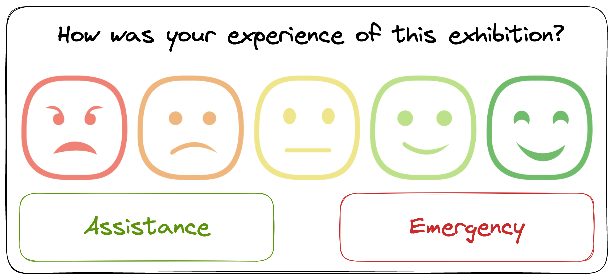

# Museum Visitors


The Liverpool Museum of Natural History (LMNH) hosts hundreds of thousands of visitors every year, coming to view award-winning exhibitions such as "Fossils of the Ancient Nile" and "Inordinately Fond: Biodiversity in Beetles".

LMNH's core mission is 'to provide value to the Liverpool community and the wider public'. As part of this mission, the museum regularly collects data on visitor satisfaction and wellbeing, which is then used to target exhibition development and maintenance. In the past, the museum has collected this data through written surveys and online reviews, but LMNH has recently secured funding for a new project focused on gathering immediate user feedback. This project is currently being trialled in several key exhibitions.

["Smiley Face Survey Kiosks"](https://www.surveystance.com/smiley-face-survey-kiosk-app/) have been placed at the exits of the exhibitions; visitors are asked to rate their experience of the exhibition on a five-point scale (from 😡 to 😀). Each kiosk features two other buttons: an "assistance" button, for general enquiries, and an "emergency" button for immediate support.



## Brief

While the kiosks are currently operational, nothing is actually being done with the visitor data yet. LMNH wants to develop an automated pipeline that would combine, store, and analyse all the kiosk data automatically, allowing museum staff to access continually-updating information on the museum's operation.

## Stakeholders

For this project, we have two main internal [stakeholders](https://www.investopedia.com/terms/s/stakeholder.asp) within LMNH.

---

### Angela Millay (Exhibitions Manager)

Angela leads a team of exhibition producers who are responsible for planning and creating new exhibitions. Her team's [KPI](https://www.qlik.com/us/kpi)s are focused on increasing visitor engagement and satisfaction.

Currently, Angela uses visitor satisfaction surveys to identify successful exhibitions and plan out new work, but this is a slow, manual process, not showing results for several months after a new exhibition launches. She's hoping that the new system will allow her team to accurately identify high-performing exhibitions in near realtime, automating the data collection and analysis so she can focus on her core responsibilities.

---

### Rita Pelkman (Head of Security & Visitor Safety)

Rita is responsible for visitor safety. She plans out staff patrol routes and identifies potential hazards on the LMNH site. This planning is currently not data-informed at all, as there has previously been no tracking of where emergencies/problems occur.

Rita is unconvinced that the new system will provide sufficient value for the amount that it has cost the museum; she thinks that a greater investment in staff would have greater benefits. However, she is optimistic about the possibility of being able to see easily where visitors are most likely to ask for assistance.

---

## The Task

Over the next two weeks, you're going to build and deploy a data pipeline for the kiosk data. This will collate, clean, and store all the visitor interactions in a database, as well as making key metrics accessible through an online dashboard.

In this first week, we'll focus on understanding the data fully and designing an appropriate storage solution for it.

### Outputs

During this week, you'll work on several related-but-distinct tasks. In total, you'll produce the following code outputs:

- An extract Python script that connects to S3 and downloads files relevant to the project
- A database setup script that creates required database tables and seeds them with initial data
- A pipeline script that downloads kiosk data from S3 and uploads it to the database
- An analysis notebook, that connects to the database and explores the data it contains

Each of the above outputs should be independent, even if they interact with the same resources; running one script should not involve running any other.

## The Data

For this week, we're going to work with a static sample of data from the kiosks, rather than realtime streaming. This allows us to prepare our pipeline stages carefully before having to grapple with live data.

The data sample is stored on an AWS S3 bucket. The bucket is a general-purpose one, containing many different files, and not all of those files are relevant to this project.

Specifically, there are two types of relevant file:

1. `.csv` files containing kiosk output
2. `.json` files with details on specific exhibits

### Kiosk output data

The `.csv` files for this project have a common naming convention; each file is entitled `lmnh_hist_data_X.csv`, where `X` is an integer showing where the file comes in the sequence. Any files matching this naming pattern contain historical kiosk data and should be combined together to form the full dataset.

The `csv` files all have the same columns:

```sh
at, site, val, type
```

- `at` refers to the date & time of the visitor interaction
- `site` refers to the unique ID of a specific exhibit
- `val` is a number representing what button the visitor pushed
  - Values from `0` to `4` are ratings, with `4` representing the highest rating
  - A value of `-1` means that one of the other buttons ("assistance" or "emergency") has been pressed
- `type` only has a value when the `val` field is `-1`; `0` represents the "assistance" button, `1` the "emergency"

While ratings are stored numerically, each one does have an associated description:

- 0: Terrible
- 1: Bad
- 2: Neutral
- 3: Good
- 4: Amazing

LMNH has no _current_ plans to change the number of buttons, or the meaning of each button, but would like the option to do so easily in the future. Your eventual data storage solution should be flexible enough to accommodate this.

### Exhibit data

The `.json` files for the exhibits follow a similar naming structure - `lmnh_exhibition_XXXXX.json` - where `XXXXX` is a single word (of no set length) describing the exhibition. Each file describes a different exhibition and has the following keys:

```sh
EXHIBITION_NAME, EXHIBITION_ID, FLOOR, DEPARTMENT, START_DATE, DESCRIPTION
```

### Data validity

Although care has been taken to clean and prepare the sample data for analysis, data cleaning is always an imperfect process, and there may well be small issues within the dataset. More importantly, the eventual input data stream will not have been cleaned in the same way, and LMNH may decide to change which exhibitions are being monitored at some point in the future. Taken together, this means that although direct data cleaning will not be a focus for this week, building testable, extensible code that doesn't make too many assumptions about the data is very important.